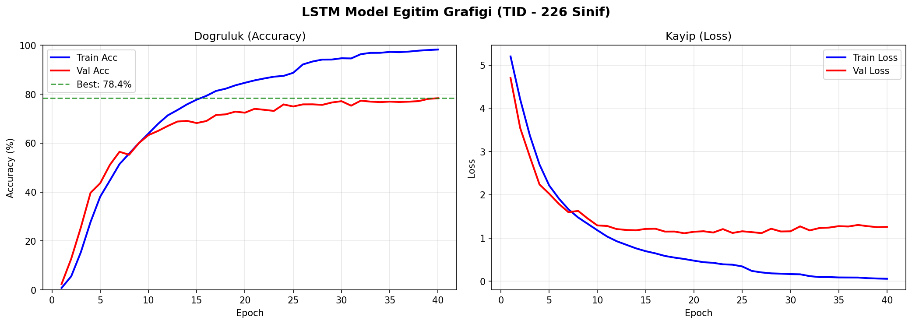

# 🤟 DeepSign-TID — Türk İşaret Dili Tanıma Sistemi
### Turkish Sign Language Recognition System

<p align="center">
  
</p>

---

## 🇹🇷 Türkçe

### 📌 Proje Hakkında

DeepSign-TID, gerçek zamanlı **Türk İşaret Dili (TİD)** tanıma sistemidir. Kamera görüntüsünden el ve vücut hareketlerini algılayarak 226 farklı işareti tanıyabilir ve cümle oluşturabilir.

### 🏆 Sonuçlar

| Model | Doğruluk | Top-3 | Epoch |
|-------|----------|-------|-------|
| MLP (Baseline) | %69.94 | %88.16 | 80 |
| **LSTM (Final)** | **%78.36** | **%91.40** | 60 |

- **226 sınıf** üzerinde %78.36 doğruluk
- **Top-3 %91.40** → Neredeyse her zaman doğru tahmin ilk 3'te
- Early stopping ile gereksiz eğitim önlendi

### 🔧 Teknik Detaylar

**Model Mimarisi (SimpleLSTM):**
- 2 katmanlı çift yönlü (bidirectional) LSTM
- Attention pooling (tüm zaman adımlarında ağırlıklı ortalama)
- LayerNorm + Dropout (0.5) ile güçlü regularization
- ~2.8M parametre

**Veri İşleme:**
- Veri seti: [AUTSL](https://cvml.ankara.edu.tr/datasets/) (226 sınıf, ~35.000 video)
- MediaPipe Tasks API ile landmark çıkarımı
- Her frame: 258 özellik (33 vücut × 4 + 21 sol el × 3 + 21 sağ el × 3)
- Sekans uzunluğu: 48 frame (~1.6 saniye)

**Web Uygulaması:**
- Hareket tabanlı işaret segmentasyonu (sürekli tahmin yerine)
- Gerçek zamanlı landmark görselleştirme
- Flask + OpenCV + MediaPipe Tasks API

### 🚀 Hızlı Başlangıç

```bash
# 1. Conda ortamını aktifle (GPU desteği için)
conda activate base

# 2. Projeyi başlat
python run.py
# Seçenek 4: Web Application

# 3. Tarayıcıda aç
# http://localhost:5000
```

### 📁 Proje Yapısı

```
DeepSign-TID/
├── app/
│   ├── server.py              # Flask web sunucusu
│   ├── pytorch_predictor.py   # PyTorch + MediaPipe entegrasyonu
│   ├── templates/             # HTML şablonları
│   └── static/                # CSS/JS dosyaları
├── src/
│   ├── data/
│   │   ├── preprocess.py      # MediaPipe landmark çıkarımı
│   │   └── dataset.py         # PyTorch Dataset sınıfı
│   ├── models/
│   │   ├── ultra_simple.py    # MLP ve LSTM modelleri
│   │   └── hybrid_model.py    # Hibrit model (GRU + CNN)
│   └── training/
│       ├── train.py           # Eğitim scripti
│       └── config.py          # Hiperparametreler
├── models/
│   └── best_model.pth         # Eğitilmiş LSTM modeli (%78.36)
├── training_plot.png          # Eğitim grafiği
├── run.py                     # Ana başlatıcı
└── requirements.txt
```

### ⚙️ Gereksinimler

```bash
pip install -r requirements.txt
```

| Paket | Versiyon |
|-------|----------|
| Python | 3.13+ |
| PyTorch | 2.7.1+cu118 |
| MediaPipe | 0.10.31 |
| Flask | 3.x |
| OpenCV | 4.x |
| NumPy | 1.x |

### 🎯 Kullanım

1. Web uygulamasını başlat
2. Kameraya doğru işaret yap
3. El hareketi algılandığında sistem otomatik kayıt başlatır
4. İşaret tamamlandığında tahmin gösterilir
5. Kelimeyi cümleye ekle

---

## 🇬🇧 English

### 📌 About

DeepSign-TID is a real-time **Turkish Sign Language (TİD)** recognition system. It detects hand and body movements from a camera feed and can recognize 226 different signs to build sentences.

### 🏆 Results

| Model | Accuracy | Top-3 | Epochs |
|-------|----------|-------|--------|
| MLP (Baseline) | 69.94% | 88.16% | 80 |
| **LSTM (Final)** | **78.36%** | **91.40%** | 60 |

- **78.36% accuracy** across 226 sign classes
- **91.40% Top-3** → Correct sign almost always in top 3 predictions
- Early stopping prevented overfitting

### 🔧 Technical Details

**Model Architecture (SimpleLSTM):**
- 2-layer bidirectional LSTM
- Attention pooling over all timesteps
- LayerNorm + Dropout (0.5) for strong regularization
- ~2.8M parameters

**Data Pipeline:**
- Dataset: [AUTSL](https://cvml.ankara.edu.tr/datasets/) (226 classes, ~35,000 videos)
- Landmark extraction via MediaPipe Tasks API
- Per frame: 258 features (33 pose × 4 + 21 left hand × 3 + 21 right hand × 3)
- Sequence length: 48 frames (~1.6 seconds)

**Web Application:**
- Motion-based sign segmentation (predicts only on complete gestures)
- Real-time landmark visualization
- Flask + OpenCV + MediaPipe Tasks API

### 🚀 Quick Start

```bash
# 1. Activate conda environment (for GPU support)
conda activate base

# 2. Launch the app
python run.py
# Select option 4: Web Application

# 3. Open in browser
# http://localhost:5000
```

### ⚙️ Requirements

```bash
pip install -r requirements.txt
```

| Package | Version |
|---------|---------|
| Python | 3.13+ |
| PyTorch | 2.7.1+cu118 |
| MediaPipe | 0.10.31 |
| Flask | 3.x |
| OpenCV | 4.x |
| NumPy | 1.x |

### 🎯 How to Use

1. Start the web application
2. Face the camera and perform a sign
3. System automatically starts recording when hand movement is detected
4. Prediction is shown when the sign is complete
5. Add the word to your sentence

### 📊 Training Your Own Model

```bash
# Train LSTM model from scratch
python src/training/train.py --model lstm --epochs 100

# Resume from checkpoint
python src/training/train.py --model lstm --epochs 50 --resume models/best_model.pth
```

---

## 📜 License / Lisans

MIT License

## 🙏 Acknowledgements / Teşekkürler

- [AUTSL Dataset](https://cvml.ankara.edu.tr/datasets/) — Ankara Üniversitesi
- [MediaPipe](https://mediapipe.dev/) — Google
